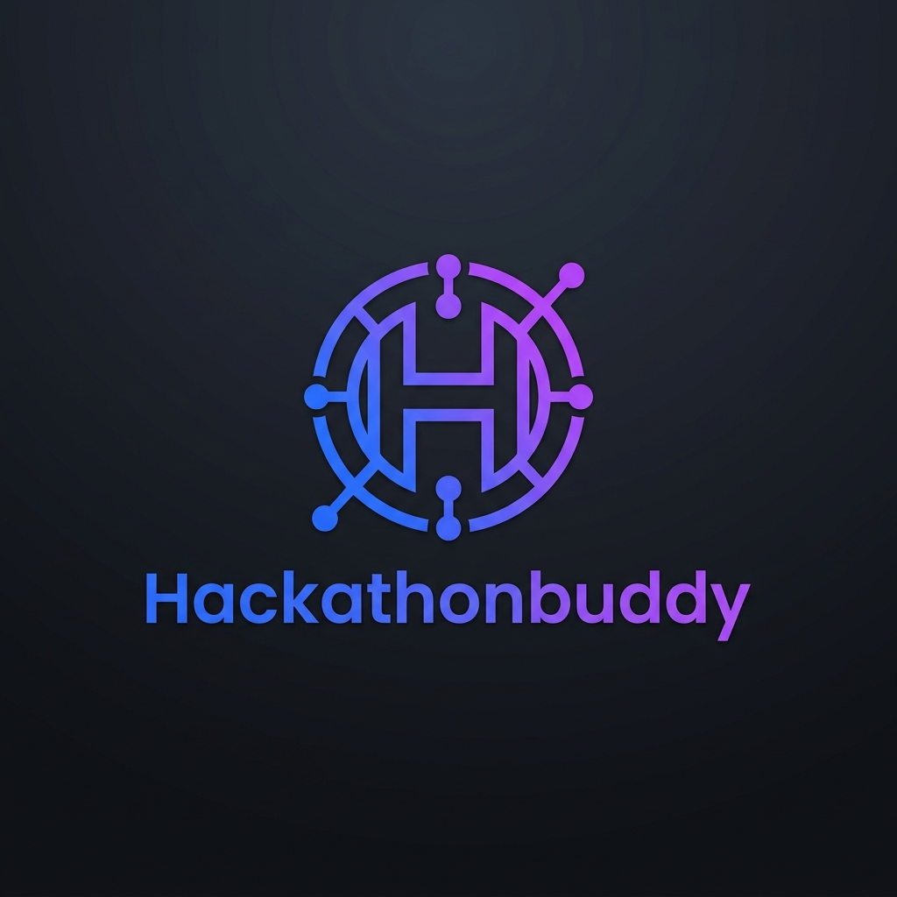
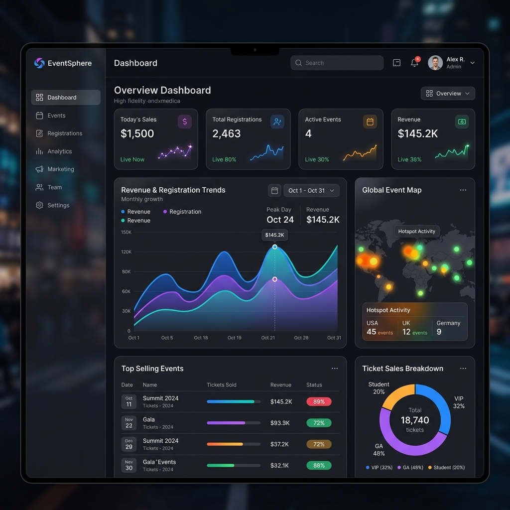

<div align="center">
  
  <h1>Hackathonbuddy Ecosystem</h1>
  <p><strong>The ultimate production-ready SaaS platform for world-class hackathon management.</strong></p>
  
  <p>
    
    
    
    
  </p>
</div>

---

## ✨ Overview

Hackathonbuddy is a full-stack event CRM and management ecosystem designed to handle the complexities of modern hackathons. From high-conversion marketing pages to real-time QR scanning for volunteers, this platform provides a seamless end-to-end experience for organizers, participants, and admins.

<div align="center">
  
</div>

---

## 🚀 Key Modules

### 🎨 1. Marketing & Growth
- **Premium Landing Page**: Editorial-grade UI designed to convert sponsors and participants.
- **Dynamic Blog**: Built-in content management for announcements and thought leadership.
- **SEO Optimized**: High-performance architecture for maximum visibility.

### 👥 2. Participant Experience
- **Frictionless Registration**: Smooth onboarding with multi-step forms.
- **Integrated Payments**: Secure transactions via Razorpay.
- **Digital Ticketing**: Automated QR-coded tickets sent directly to email.

### 📊 3. Organizer Dashboard
- **Real-time Analytics**: Live tracking of registrations, revenue, and attendee demographics.
- **Team Management**: Centralized hub for overseeing submissions and judging.
- **Exportable Data**: One-click reports for logistics and planning.

### 🛡️ 4. Admin Governance
- **Platform Oversight**: High-level monitoring of all active events.
- **Role-Based Access (RBAC)**: Fine-grained permissions for security and integrity.

### 📱 5. Volunteer Scanning
- **High-speed QR Scanning**: Mobile-optimized interface for rapid check-ins.
- **Instant Validation**: Real-time verification of participant credentials.

---

## 🛠️ Tech Stack

- **Frontend**: [React 19](https://react.dev/), [Vite](https://vitejs.dev/), [Tailwind CSS 4](https://tailwindcss.com/)
- **State & Animation**: [Framer Motion](https://www.framer.com/motion/), [Context API](https://react.dev/learn/passing-data-deeply-with-context)
- **Backend & DB**: [Firebase](https://firebase.google.com/) (Auth, Firestore, Functions, Hosting)
- **Payments**: [Razorpay](https://razorpay.com/)
- **QR Engine**: [HTML5-QRCode](https://github.com/mebjas/html5-qrcode)

---

## ⚙️ Getting Started

### 1. Installation
```bash
# Clone the repository
git clone https://github.com/dhivakarmada/hackathonbuddy.git

# Install frontend dependencies
npm install

# Install backend dependencies
cd functions && npm install
```

### 2. Configuration
Create a `.env` file in the root:
```env
VITE_FIREBASE_API_KEY=your_api_key
VITE_RAZORPAY_KEY=your_razorpay_key
```

### 3. Run Development
```bash
# Start Vite dev server
npm run dev

# Start Firebase Emulators
firebase emulators:start
```

---

<div align="center">
  <p>Built with ❤️ for the global Hackathon community.</p>
  <p>© 2026 Hackathonbuddy Ecosystem. All rights reserved.</p>
</div>
